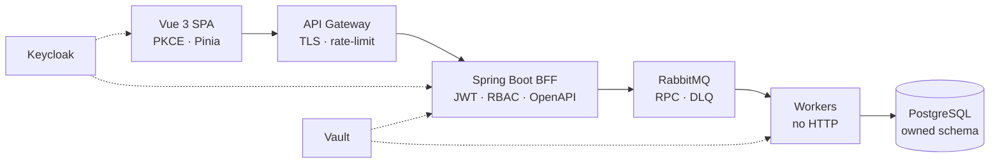

  

 

&nbsp;
[English](#en)
&nbsp;·&nbsp;

&nbsp;
[Português (Brasil)](#pt)
&nbsp;·&nbsp;

&nbsp;
[Português (Portugal)](#pt-pt)
&nbsp;·&nbsp;

&nbsp;
[Español](#es)
&nbsp;·&nbsp;

&nbsp;
[Deutsch](#de)
&nbsp;·&nbsp;

&nbsp;
[日本語](#ja)

  
  
  
  
  
   
  
  
  
  
   
  
  
  
  
   
  
  
  
  
   
  
  
  
  

---

## English

**Available for new opportunities** · Curitiba, Paraná, Brazil

[Portfolio](https://mateusmatyak-git.github.io/)
· [Architecture](https://mateusmatyak-git.github.io/architecture)
· [Projects](https://mateusmatyak-git.github.io/projects)
· [LinkedIn](https://www.linkedin.com/in/mateus-matyak-78b097429/)
· [Email](mailto:mateus.matyak@hotmail.com)

[↑ Languages](#languages)

I design and build secure, event-driven microservice ecosystems, from Vue.js frontends to Spring Boot backends.

A Vue.js SPA talks only to a Spring Boot BFF. The BFF authenticates through Keycloak, authorizes by role, and publishes RPC on RabbitMQ. Workers own the business rule and their PostgreSQL schema — no HTTP on the worker, no JDBC on the BFF. Credentials live in Vault, never in source.

The details that keep a system boring in the best way: predictable, resilient, and easy to reason about.

Delivery follows the same cut: Git Flow from `develop`, Jenkins reads the branch prefix, Sonar is the gate, Docker is the same artifact, OKE isolates staging and production. The [tech guide](https://mateusmatyak-git.github.io/tech-guide) spells out what each piece is for.

### Selected work

Commercial systems. Source stays closed unless the client says otherwise. Each case on the [portfolio](https://mateusmatyak-git.github.io/projects) has a walkthrough of the real flow.

| | What it does |
| --- | --- |
| **[Caçador Seguros](https://cacadorseguros.com.br/)** · Vue 3, Vuetify, Pinia, pdf.js | Internal quoting for the brokerage. The broker imports the insurer PDF; parsers detect the source, extract the fields, and issue a document in Caçador's layout. |
| **Event-driven platform** · Vue 3, Spring Boot, RabbitMQ, Keycloak, Vault, PostgreSQL | SPA talks only to the BFF. The BFF validates the JWT, publishes a command, and a worker — owner of its database — handles it off the HTTP request. |
| **Support console** · Vue 3, Pinia, REST, PostgreSQL | Internal tool for the support team: classify the request, look for a fast fix, open a tracked protocol. Built to shorten the path from chat to the owning team. |
| **Operations PWA** · Vue 3, PWA, IndexedDB | Counter operations that work offline. Intents queue on the device and replay in order against the BFF when the network is back. |

### Now

Full-stack at **SaaSTec Labs** — Vue.js PWAs and Spring Boot in an event-driven microservice architecture. Before that: senior support at Korp ERP (Viasoft) and a path through support and internal tools at SaaSTec, overlapping a degree finished in 2023. Timeline on the [experience page](https://mateusmatyak-git.github.io/experience).

### Contact

Open to full-stack roles, architecture conversations, and collaborations. Email is the preferred channel.

- **Email:** [mateus.matyak@hotmail.com](mailto:mateus.matyak@hotmail.com)
- **LinkedIn:** [linkedin.com/in/mateus-matyak](https://www.linkedin.com/in/mateus-matyak-78b097429/)
- **Portfolio:** [mateusmatyak-git.github.io](https://mateusmatyak-git.github.io/)

---

## Português (Brasil)

**Disponível para novas oportunidades** · Curitiba, Paraná, Brasil

[Portfólio](https://mateusmatyak-git.github.io/)
· [Arquitetura](https://mateusmatyak-git.github.io/architecture)
· [Projetos](https://mateusmatyak-git.github.io/projects)
· [LinkedIn](https://www.linkedin.com/in/mateus-matyak-78b097429/)
· [E-mail](mailto:mateus.matyak@hotmail.com)

[↑ Idiomas](#languages)

Eu projeto e construo ecossistemas de microsserviços seguros e orientados a eventos, de frontends em Vue.js a backends em Spring Boot.

Uma SPA em Vue.js conversa só com um BFF em Spring Boot. O BFF autentica no Keycloak, autoriza por role e publica RPC no RabbitMQ. Os workers são donos da regra de negócio e do schema no PostgreSQL — sem HTTP no worker, sem JDBC no BFF. Credenciais ficam no Vault, nunca no código.

Os detalhes que mantêm um sistema chato do jeito certo: previsível, resiliente e fácil de entender.

A entrega segue o mesmo recorte: Git Flow a partir da `develop`, Jenkins lê o prefixo da branch, Sonar é o gate, Docker é o mesmo artefato, OKE isola homologação e produção. O [guia das ferramentas](https://mateusmatyak-git.github.io/tech-guide) explica pra que cada peça serve.

### Projetos

Sistemas comerciais. O código continua fechado a menos que o cliente autorize. Cada caso no [portfólio](https://mateusmatyak-git.github.io/projects) tem uma simulação do fluxo real.

| | O que faz |
| --- | --- |
| **[Caçador Seguros](https://cacadorseguros.com.br/)** · Vue 3, Vuetify, Pinia, pdf.js | Sistema interno de orçamentos da corretora. O corretor importa o PDF da cotação; parsers detectam a origem, extraem os campos e emitem o documento no layout da Caçador. |
| **Plataforma de eventos** · Vue 3, Spring Boot, RabbitMQ, Keycloak, Vault, PostgreSQL | A SPA fala só com o BFF. O BFF valida o JWT, publica o comando, e o worker — dono do banco — processa fora da requisição HTTP. |
| **Console de atendimento** · Vue 3, Pinia, REST, PostgreSQL | Ferramenta interna do suporte: classifica a demanda, busca uma solução rápida e abre um protocolo rastreável. Encurta o caminho do chat ao time dono do incidente. |
| **PWA operacional** · Vue 3, PWA, IndexedDB | Operação no balcão que funciona offline. As intenções entram numa fila no aparelho e sincronizam com o BFF quando a rede volta. |

### Agora

Full-stack na **SaaSTec Labs** — PWAs em Vue.js e Spring Boot em arquitetura de microsserviços orientada a eventos. Antes: suporte sênior na Korp ERP (Viasoft) e um caminho por suporte e ferramentas internas na SaaSTec, em paralelo à graduação concluída em 2023. A linha do tempo está em [experiências](https://mateusmatyak-git.github.io/experience).

### Contato

Aberto a oportunidades full-stack, conversas de arquitetura e colaborações. E-mail é o canal preferencial.

- **E-mail:** [mateus.matyak@hotmail.com](mailto:mateus.matyak@hotmail.com)
- **LinkedIn:** [linkedin.com/in/mateus-matyak](https://www.linkedin.com/in/mateus-matyak-78b097429/)
- **Portfólio:** [mateusmatyak-git.github.io](https://mateusmatyak-git.github.io/)

---

## Português (Portugal)

**Disponível para novas oportunidades** · Curitiba, Paraná, Brasil

[Portefólio](https://mateusmatyak-git.github.io/)
· [Arquitetura](https://mateusmatyak-git.github.io/architecture)
· [Projetos](https://mateusmatyak-git.github.io/projects)
· [LinkedIn](https://www.linkedin.com/in/mateus-matyak-78b097429/)
· [E-mail](mailto:mateus.matyak@hotmail.com)

[↑ Idiomas](#languages)

Eu projeto e construo ecossistemas de microsserviços seguros e orientados a eventos, de frontends em Vue.js a backends em Spring Boot.

Uma SPA em Vue.js conversa só com um BFF em Spring Boot. O BFF autentica no Keycloak, autoriza por role e publica RPC no RabbitMQ. Os workers são donos da regra de negócio e do schema no PostgreSQL — sem HTTP no worker, sem JDBC no BFF. As credenciais ficam no Vault, nunca no código.

Os detalhes que mantêm um sistema aborrecido da melhor forma: previsível, resiliente e fácil de entender.

A entrega segue o mesmo recorte: Git Flow a partir da `develop`, Jenkins lê o prefixo da branch, Sonar é o gate, Docker é o mesmo artefato, OKE isola homologação e produção. O [guia das ferramentas](https://mateusmatyak-git.github.io/tech-guide) explica para que serve cada peça.

### Projetos

Sistemas comerciais. O código continua fechado a menos que o cliente autorize. Cada caso no [portefólio](https://mateusmatyak-git.github.io/projects) tem uma simulação do fluxo real.

| | O que faz |
| --- | --- |
| **[Caçador Seguros](https://cacadorseguros.com.br/)** · Vue 3, Vuetify, Pinia, pdf.js | Sistema interno de orçamentos da corretora. O corretor importa o PDF da cotação; parsers detetam a origem, extraem os campos e emitem o documento no layout da Caçador. |
| **Plataforma de eventos** · Vue 3, Spring Boot, RabbitMQ, Keycloak, Vault, PostgreSQL | A SPA fala só com o BFF. O BFF valida o JWT, publica o comando, e o worker — dono da base de dados — processa fora do pedido HTTP. |
| **Console de atendimento** · Vue 3, Pinia, REST, PostgreSQL | Ferramenta interna do suporte: classifica o pedido, procura uma solução rápida e abre um protocolo rastreável. Encurta o caminho do chat à equipa dona do incidente. |
| **PWA operacional** · Vue 3, PWA, IndexedDB | Operação no balcão que funciona offline. As intenções entram numa fila no dispositivo e sincronizam com o BFF quando a rede volta. |

### Agora

Full-stack na **SaaSTec Labs** — PWAs em Vue.js e Spring Boot em arquitetura de microsserviços orientada a eventos. Antes: suporte sénior na Korp ERP (Viasoft) e um percurso por suporte e ferramentas internas na SaaSTec, em paralelo à graduação concluída em 2023. A cronologia está em [experiências](https://mateusmatyak-git.github.io/experience).

### Contacto

Aberto a oportunidades full-stack, conversas de arquitetura e colaborações. E-mail é o canal preferencial.

- **E-mail:** [mateus.matyak@hotmail.com](mailto:mateus.matyak@hotmail.com)
- **LinkedIn:** [linkedin.com/in/mateus-matyak](https://www.linkedin.com/in/mateus-matyak-78b097429/)
- **Portefólio:** [mateusmatyak-git.github.io](https://mateusmatyak-git.github.io/)

---

## Español

**Disponible para nuevas oportunidades** · Curitiba, Paraná, Brasil

[Portafolio](https://mateusmatyak-git.github.io/)
· [Arquitectura](https://mateusmatyak-git.github.io/architecture)
· [Proyectos](https://mateusmatyak-git.github.io/projects)
· [LinkedIn](https://www.linkedin.com/in/mateus-matyak-78b097429/)
· [Correo](mailto:mateus.matyak@hotmail.com)

[↑ Idiomas](#languages)

Diseño y construyo ecosistemas de microservicios seguros y orientados a eventos, desde frontends en Vue.js hasta backends en Spring Boot.

Una SPA en Vue.js solo habla con un BFF en Spring Boot. El BFF autentica con Keycloak, autoriza por rol y publica RPC en RabbitMQ. Los workers son dueños de la regla de negocio y de su esquema en PostgreSQL: sin HTTP en el worker, sin JDBC en el BFF. Las credenciales viven en Vault, nunca en el código.

Los detalles que mantienen un sistema aburrido de la mejor manera: predecible, resiliente y fácil de razonar.

La entrega sigue el mismo corte: Git Flow desde `develop`, Jenkins lee el prefijo de la rama, Sonar es el gate, Docker es el mismo artefacto, OKE aísla staging y producción. La [guía técnica](https://mateusmatyak-git.github.io/tech-guide) explica para qué sirve cada pieza.

### Proyectos

Sistemas comerciales. El código sigue cerrado salvo que el cliente lo autorice. Cada caso en el [portafolio](https://mateusmatyak-git.github.io/projects) tiene un recorrido del flujo real.

| | Qué hace |
| --- | --- |
| **[Caçador Seguros](https://cacadorseguros.com.br/)** · Vue 3, Vuetify, Pinia, pdf.js | Sistema interno de cotización para la correduría. El corredor importa el PDF de la aseguradora; parsers detectan el origen, extraen los campos y emiten el documento en el layout de Caçador. |
| **Plataforma orientada a eventos** · Vue 3, Spring Boot, RabbitMQ, Keycloak, Vault, PostgreSQL | La SPA solo habla con el BFF. El BFF valida el JWT, publica el comando y un worker —dueño de su base— lo procesa fuera de la solicitud HTTP. |
| **Consola de soporte** · Vue 3, Pinia, REST, PostgreSQL | Herramienta interna del equipo de soporte: clasificar la solicitud, buscar una solución rápida y abrir un protocolo rastreable. |
| **PWA de operaciones** · Vue 3, PWA, IndexedDB | Operación de mostrador que funciona sin conexión. Las intenciones se encolan en el dispositivo y se sincronizan con el BFF cuando vuelve la red. |

### Ahora

Full-stack en **SaaSTec Labs** — PWAs en Vue.js y Spring Boot en una arquitectura de microservicios orientada a eventos. Antes: soporte sénior en Korp ERP (Viasoft) y un recorrido por soporte y herramientas internas en SaaSTec, en paralelo a un grado terminado en 2023. La línea de tiempo está en [experiencia](https://mateusmatyak-git.github.io/experience).

### Contacto

Abierto a roles full-stack, conversaciones de arquitectura y colaboraciones. El correo es el canal preferido.

- **Correo:** [mateus.matyak@hotmail.com](mailto:mateus.matyak@hotmail.com)
- **LinkedIn:** [linkedin.com/in/mateus-matyak](https://www.linkedin.com/in/mateus-matyak-78b097429/)
- **Portafolio:** [mateusmatyak-git.github.io](https://mateusmatyak-git.github.io/)

---

## Deutsch

**Verfügbar für neue Positionen** · Curitiba, Paraná, Brasilien

[Portfolio](https://mateusmatyak-git.github.io/)
· [Architektur](https://mateusmatyak-git.github.io/architecture)
· [Projekte](https://mateusmatyak-git.github.io/projects)
· [LinkedIn](https://www.linkedin.com/in/mateus-matyak-78b097429/)
· [E-Mail](mailto:mateus.matyak@hotmail.com)

[↑ Sprachen](#languages)

Ich entwerfe und baue sichere, ereignisgesteuerte Microservice-Ökosysteme — von Vue.js-Frontends bis zu Spring-Boot-Backends.

Eine Vue.js-SPA spricht nur mit einem Spring-Boot-BFF. Der BFF authentifiziert über Keycloak, autorisiert nach Rolle und veröffentlicht RPC auf RabbitMQ. Worker besitzen die Geschäftsregel und ihr PostgreSQL-Schema — kein HTTP auf dem Worker, kein JDBC auf dem BFF. Anmeldedaten leben in Vault, niemals im Quellcode.

Die Details, die ein System auf die beste Art langweilig halten: vorhersagbar, widerstandsfähig und nachvollziehbar.

Die Lieferung folgt demselben Schnitt: Git Flow von `develop`, Jenkins liest das Branch-Präfix, Sonar ist das Gate, Docker ist dasselbe Artefakt, OKE isoliert Staging und Produktion. Der [Technikleitfaden](https://mateusmatyak-git.github.io/tech-guide) erklärt, wofür jedes Stück da ist.

### Projekte

Kommerzielle Systeme. Der Quellcode bleibt geschlossen, sofern der Kunde nichts anderes erlaubt. Jeder Fall im [Portfolio](https://mateusmatyak-git.github.io/projects) hat einen Durchlauf des echten Ablaufs.

| | Was es tut |
| --- | --- |
| **[Caçador Seguros](https://cacadorseguros.com.br/)** · Vue 3, Vuetify, Pinia, pdf.js | Internes Angebotssystem für die Maklerfirma. Der Makler importiert das Versicherer-PDF; Parser erkennen die Quelle, extrahieren die Felder und stellen ein Dokument im Layout von Caçador aus. |
| **Ereignisgesteuerte Plattform** · Vue 3, Spring Boot, RabbitMQ, Keycloak, Vault, PostgreSQL | Die SPA spricht nur mit dem BFF. Der BFF prüft das JWT, veröffentlicht den Befehl, und ein Worker — Eigentümer seiner Datenbank — verarbeitet ihn außerhalb der HTTP-Anfrage. |
| **Support-Konsole** · Vue 3, Pinia, REST, PostgreSQL | Internes Werkzeug für das Support-Team: Anfrage klassifizieren, eine schnelle Lösung suchen, ein nachverfolgbares Protokoll öffnen. |
| **Operations-PWA** · Vue 3, PWA, IndexedDB | Schalterbetrieb, der offline arbeitet. Absichten landen in einer Queue auf dem Gerät und werden mit dem BFF synchronisiert, wenn das Netz zurück ist. |

### Jetzt

Full-Stack bei **SaaSTec Labs** — Vue.js-PWAs und Spring Boot in einer ereignisgesteuerten Microservice-Architektur. Davor: Senior-Support bei Korp ERP (Viasoft) und ein Weg durch Support und interne Werkzeuge bei SaaSTec, parallel zum 2023 abgeschlossenen Studium. Die Zeitleiste steht unter [Erfahrung](https://mateusmatyak-git.github.io/experience).

### Kontakt

Offen für Full-Stack-Rollen, Architekturgespräche und Zusammenarbeit. E-Mail ist der bevorzugte Kanal.

- **E-Mail:** [mateus.matyak@hotmail.com](mailto:mateus.matyak@hotmail.com)
- **LinkedIn:** [linkedin.com/in/mateus-matyak](https://www.linkedin.com/in/mateus-matyak-78b097429/)
- **Portfolio:** [mateusmatyak-git.github.io](https://mateusmatyak-git.github.io/)

---

## 日本語

**新しい機会を募集しています** · クリチバ、パラナ州、ブラジル

[ポートフォリオ](https://mateusmatyak-git.github.io/)
· [アーキテクチャ](https://mateusmatyak-git.github.io/architecture)
· [プロジェクト](https://mateusmatyak-git.github.io/projects)
· [LinkedIn](https://www.linkedin.com/in/mateus-matyak-78b097429/)
· [メール](mailto:mateus.matyak@hotmail.com)

[↑ 言語](#languages)

Vue.jsのフロントエンドからSpring Bootのバックエンドまで、セキュアでイベント駆動型のマイクロサービスエコシステムを設計・構築しています。

Vue.jsのSPAはSpring BootのBFFとだけ話します。BFFはKeycloakで認証し、ロールで認可し、RabbitMQへRPCを発行します。Workerはビジネスルールと自身のPostgreSQLスキーマを所有します。WorkerにHTTPはなく、BFFにJDBCはありません。認証情報はVaultにあり、ソースにはありません。

システムを良い意味で退屈に保つ細部です。予測可能で、耐障害性が高く、理解しやすい状態です。

デリバリーも同じ切り方です。`develop`からのGit Flow、Jenkinsがブランチプレフィックスを読み、Sonarがゲート、Dockerは同一アーティファクト、OKEがステージングと本番を隔離します。各要素の役割は[テックガイド](https://mateusmatyak-git.github.io/tech-guide)にあります。

### プロジェクト

商用システムです。クライアントが許可しない限り、ソースは非公開です。各事例は[ポートフォリオ](https://mateusmatyak-git.github.io/projects)で実際のフローをたどれます。

| | 内容 |
| --- | --- |
| **[Caçador Seguros](https://cacadorseguros.com.br/)** · Vue 3, Vuetify, Pinia, pdf.js | ブローカー向けの社内見積システムです。保険会社のPDFを取り込み、パーサーが出所を検出してフィールドを抽出し、Caçadorのレイアウトで書類を発行します。 |
| **イベント駆動プラットフォーム** · Vue 3, Spring Boot, RabbitMQ, Keycloak, Vault, PostgreSQL | SPAはBFFとだけ話します。BFFがJWTを検証してコマンドを発行し、自身のDBを所有するworkerがHTTPリクエストの外で処理します。 |
| **サポートコンソール** · Vue 3, Pinia, REST, PostgreSQL | サポートチーム向けの社内ツールです。依頼を分類し、迅速な修正を探し、追跡可能なプロトコルを開きます。 |
| **オペレーションPWA** · Vue 3, PWA, IndexedDB | カウンター業務向けで、オフラインで動きます。インテントは端末上のキューに入り、ネットワーク復帰時にBFFへ同期します。 |

### いま

**SaaSTec Labs**でフルスタックとして、イベント駆動マイクロサービスアーキテクチャのVue.js PWAとSpring Bootに取り組んでいます。その前はKorp ERP（Viasoft）のシニアサポート、SaaSTecでのサポートと社内ツールです。学位は2023年に修了しています。時系列は[経歴](https://mateusmatyak-git.github.io/experience)にあります。

### お問い合わせ

フルスタックのポジション、アーキテクチャの対話、協業に開いています。仕事の機会にはメールが望ましい連絡手段です。

- **メール:** [mateus.matyak@hotmail.com](mailto:mateus.matyak@hotmail.com)
- **LinkedIn:** [linkedin.com/in/mateus-matyak](https://www.linkedin.com/in/mateus-matyak-78b097429/)
- **ポートフォリオ:** [mateusmatyak-git.github.io](https://mateusmatyak-git.github.io/)
